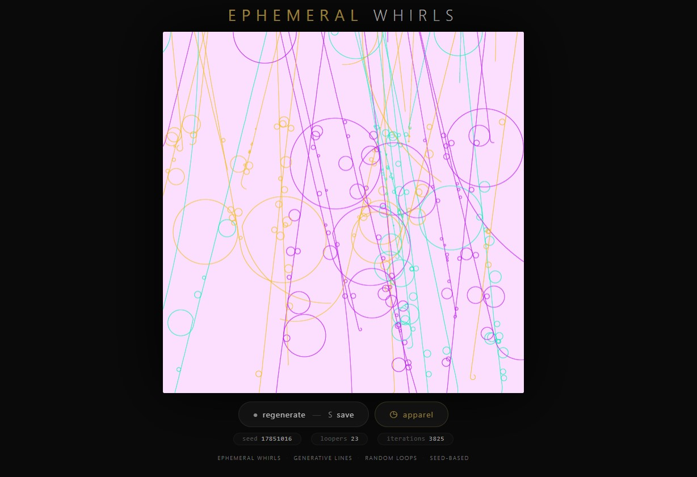
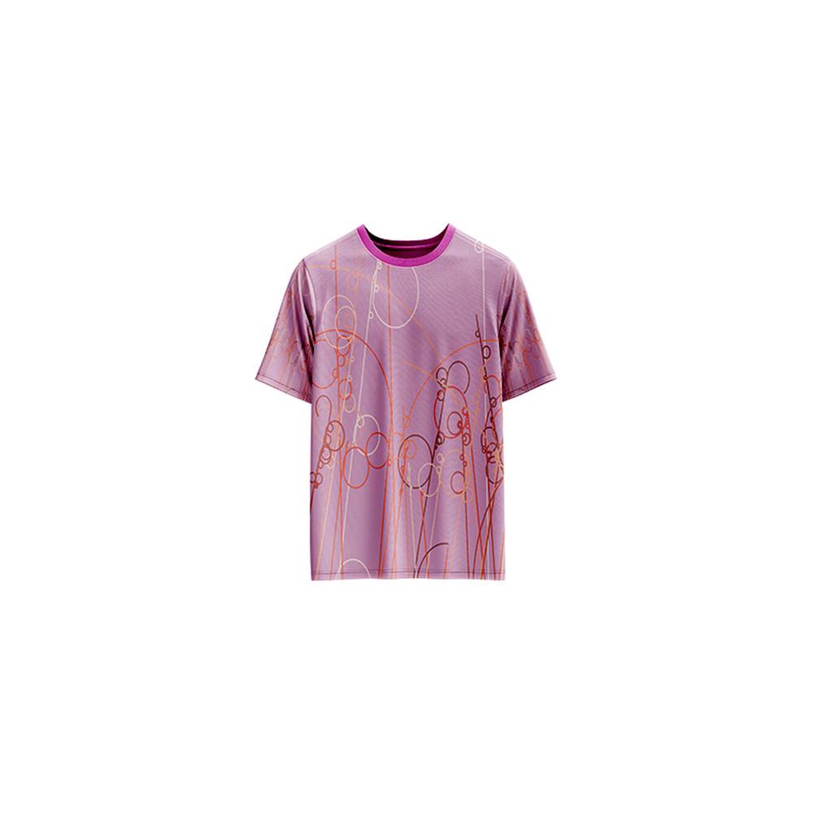

# Ephemeral Whirls — Generative Art

[](https://reyrove.github.io/Ephemeral-Whirls-Generative-Art)
[](https://opensource.org/licenses/MIT)

> **Generative line art with looping particles.** Each refresh creates a unique composition of wandering particles that leave trails of colorful lines, forming intricate, ephemeral patterns.

## 🎨 Live Demo

<div align="center">
  <a href="https://reyrove.github.io/Ephemeral-Whirls-Generative-Art" target="_blank">
    
  </a>
  <br><br>
  <a href="https://reyrove.github.io/Ephemeral-Whirls-Generative-Art" target="_blank">
    
  </a>
  <br>
  <em>Click the image or button to experience the generative art</em>
</div>

## 👕 Apparel Preview

<div align="center">
  
  <br>
  <em>Ephemeral Whirls artwork printed on a T-shirt</em>
</div>

## ✨ Features

- **Wandering Particles** — 23-25 particles that move and leave trails
- **Looping Behavior** — Particles occasionally form loops
- **Rich Color Palettes** — 43 vibrant color combinations
- **Soft Backgrounds** — 22 pastel and soft colors
- **Random Rotation** — Artwork can be oriented in 4 directions
- **Ephemeral Patterns** — Each refresh creates unique, transient compositions
- **Seed-Based** — Every composition is unique and reproducible via its seed
- **Save & Share** — Download as PNG with seed in filename
- **Apparel Mode** — Preview artwork on a T-shirt mockup
- **Responsive** — Works on desktop, tablet, and mobile
- **Pure JavaScript** — No external dependencies
- **Keyboard Shortcuts**:
  - `R` — Regenerate
  - `S` — Save image
  - `T` — Toggle apparel view

## 🎨 Artwork Details

| Parameter | Range | Description |
|-----------|-------|-------------|
| **Particles** | 23–25 | Wandering line particles |
| **Iterations** | 2000–4000 | Number of drawing steps |
| **Color Palettes** | 43 options | Vibrant color combinations |
| **Background Colors** | 22 options | Soft pastel colors |
| **Orientation** | 4 options | Up, down, left, right |

## 🎯 How It Works

The artwork creates intricate line patterns using wandering particles:

1. **Particle Behavior**:
   - Each particle moves in a random direction
   - Particles occasionally loop (circle back)
   - Speed and heading vary randomly

2. **Color System**:
   - Each particle gets a random color from a palette
   - Palettes contain 2-8 complementary colors
   - Soft pastel backgrounds provide contrast

3. **Pattern Formation**:
   - Particles leave trails as they move
   - Looping creates circular patterns
   - Thousands of iterations create complex compositions

## 🚀 Quick Start

### Local Development

```bash
# Clone the repository
git clone https://github.com/reyrove/Ephemeral-Whirls-Generative-Art.git

# Navigate to the directory
cd Ephemeral-Whirls-Generative-Art

# Open in browser
open index.html
# or use a live server
```

### Deploy to GitHub Pages

1. Push to GitHub
2. Go to Settings → Pages
3. Select branch `main` and root folder
4. Your site will be live at `https://reyrove.github.io/Ephemeral-Whirls-Generative-Art`

## 🧠 How It Works

The artwork is generated using a deterministic random number generator, seeded by timestamp + random noise. Every refresh:

1. **Setup**:
   - Random background from 22 soft colors
   - Random color palette from 43 options
   - 23-25 particles initialized
   - Random orientation (up/down/left/right)

2. **Particle Movement**:
   - Each particle moves with random speed and heading
   - Particles occasionally enter looping mode
   - Loops create circular patterns
   - Particles reset when they leave the canvas

3. **Drawing**:
   - Each particle draws a line from its previous position
   - Lines are drawn in the particle's color
   - 2000-4000 iterations create complex patterns

## 📁 File Structure

```
Ephemeral-Whirls-Generative-Art/
├── index.html              # Main application (all-in-one)
├── Ephemeral-Whirls.jpg    # T-shirt mockup image
├── fav.svg                 # Favicon
├── demo-screenshot.jpg     # Website demo screenshot
├── README.md               # This file
└── LICENSE                 # MIT License
```

## 🛠️ Tech Stack

- **Pure Vanilla HTML/CSS/JS** — No dependencies
- **Canvas API** — 2D rendering
- **CSS Flexbox/Grid** — Responsive layout
- **GitHub Pages** — Hosting

## 🎯 Interactive Controls

| Action | Keyboard | Button |
|--------|----------|--------|
| Regenerate | `R` | Click "regenerate" |
| Save Image | `S` | Click "regenerate" |
| Toggle Apparel | `T` | Click "apparel" |

## 🎨 The Creative Process

### Particle Behavior
Each particle moves like a wandering creature:
- **Random Heading**: Direction changes smoothly
- **Looping Mode**: Particles occasionally form circular paths
- **Speed Variation**: Different speeds create dynamic patterns

### Color Palettes
43 carefully curated color palettes provide vibrant, harmonious color combinations. Each palette contains 2-8 colors that work well together.

### Ephemeral Quality
The artwork captures the transient nature of movement—each composition is a unique moment in time, frozen as a static image.

### Orientation Options
The artwork can be viewed from 4 different orientations (up, down, left, right), adding variety to the composition.

## 📱 Responsive Design

The application automatically adapts to:
- Desktop screens
- Tablets
- Mobile phones
- Landscape orientation
- Various aspect ratios

## 🤝 Contributing

Contributions are welcome! Feel free to:
- Fork the repository
- Create a feature branch
- Submit a pull request

### Ideas for Contributions:
- New particle behaviors
- Additional color palettes
- Animation features
- Interactive controls
- Performance optimizations

## 📄 License

MIT License — see [LICENSE](LICENSE) file for details.

## 🙏 Acknowledgments

- Inspired by particle systems and generative art
- Pure JavaScript implementation
- Special thanks to the creative coding community

---

**Built with ❤️ and ephemeral beauty**